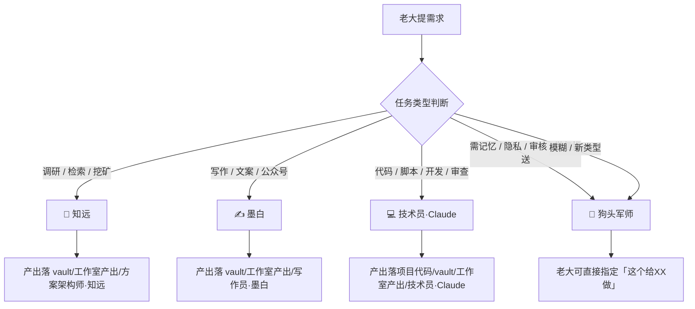
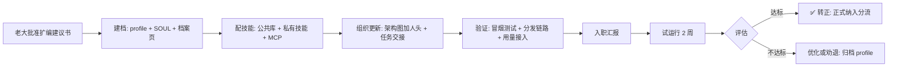
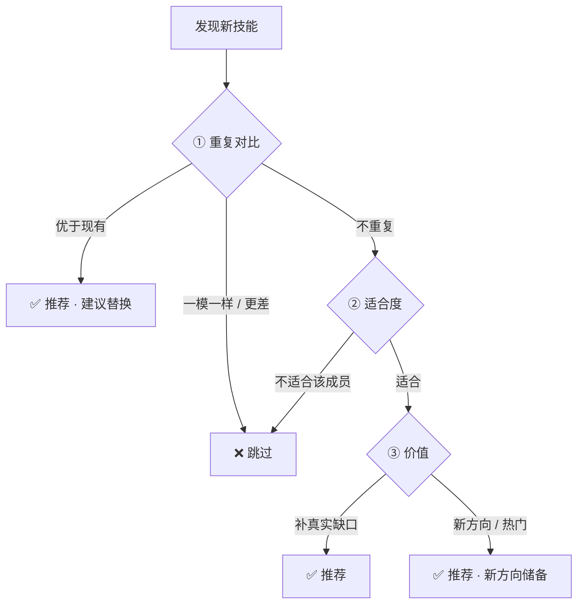
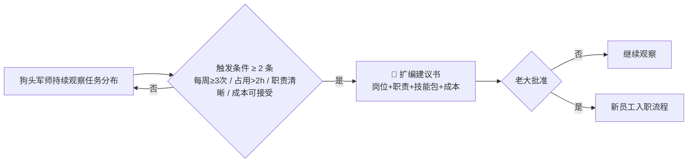

# 🏢 工作室流程总览

> 关键流程可视化(mermaid,Obsidian 直接渲染)。配套:[[组织架构]]

## 一、任务自动分流

```mermaid
flowchart TD
    A[老大提需求] --> B{任务类型判断}
    B -->|调研 / 检索 / 挖矿| C[🔬 知远]
    B -->|写作 / 文案 / 公众号| D[✍️ 墨白]
    B -->|代码 / 脚本 / 开发 / 审查| F[💻 技术员·Claude]
    B -->|需记忆 / 隐私 / 审核 / 微信推送| E[🤖 狗头军师]
    B -->|模糊 / 新类型| E
    C --> G[产出落 vault/工作室产出/方案架构师·知远]
    D --> H[产出落 vault/工作室产出/写作员·墨白]
    F --> J[产出落项目代码/vault/工作室产出/技术员·Claude]
    E --> I[老大可直接指定「这个给XX做」]
```

## 二、新员工入职流程

```mermaid
flowchart LR
    A[老大批准扩编建议书] --> B[建档: profile + SOUL + 档案页]
    B --> C[配技能: 公共库 + 私有技能 + MCP]
    C --> D[组织更新: 架构图加人头 + 任务交接]
    D --> E[验证: 冒烟测试 + 分发链路 + 用量接入]
    E --> F[入职汇报]
    F --> G[试运行 2 周]
    G --> H{评估}
    H -->|达标| I[✅ 转正: 正式纳入分流]
    H -->|不达标| J[优化或劝退: 归档 profile]
```

## 三、技能推荐三步筛选

```mermaid
flowchart TD
    A[发现新技能] --> B{① 重复对比}
    B -->|优于现有| C[✅ 推荐 · 建议替换]
    B -->|一模一样 / 更差| X[❌ 跳过]
    B -->|不重复| D{② 适合度}
    D -->|不适合该成员| X
    D -->|适合| E{③ 价值}
    E -->|补真实缺口| F[✅ 推荐]
    E -->|新方向 / 热门| G[✅ 推荐 · 新方向储备]
```

## 四、员工扩编机制

```mermaid
flowchart LR
    A[狗头军师持续观察任务分布] --> B{触发条件 ≥ 2 条<br>每周≥3次 / 占用>2h / 职责清晰 / 成本可接受}
    B -->|否| A
    B -->|是| C[📝 扩编建议书<br>岗位+职责+技能包+成本]
    C --> D{老大批准}
    D -->|否| E[继续观察]
    D -->|是| F[新员工入职流程]
```

## 相关
[[组织架构]] · [[数字员工落地全记录]] · [[数字员工可行性报告]]
