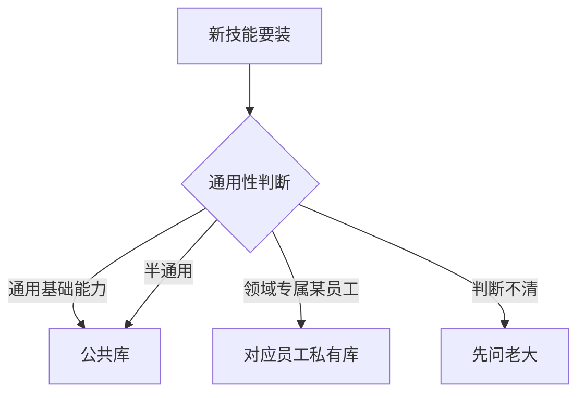
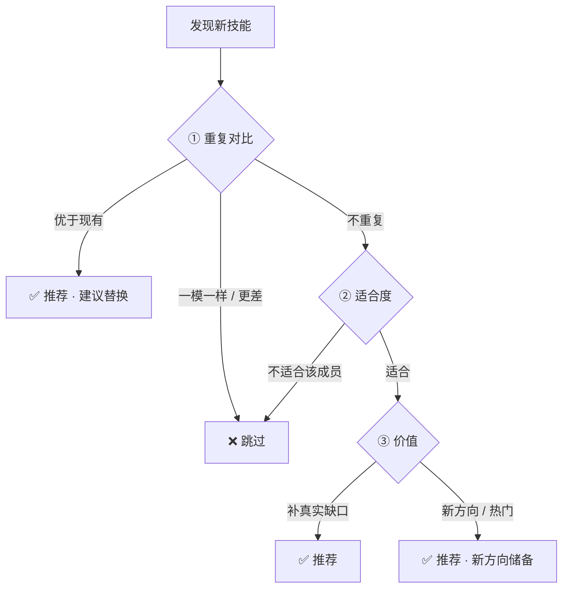
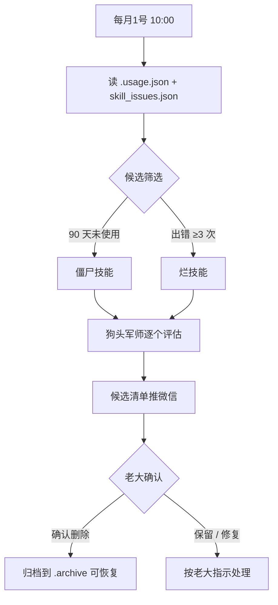

# 🧰 技能管理流程

> 技能库的归属/推荐/淘汰机制。索引:[[index]]

## 技能归属规则(装新技能时)

```mermaid
flowchart TD
    A[新技能要装] --> B{通用性判断}
    B -->|通用基础能力| C[公共库]
    B -->|领域专属某员工| D[对应员工私有库]
    B -->|半通用| C
    B -->|判断不清| E[先问老大]
```

## 技能推荐三步筛选(21:30 全员)

```mermaid
flowchart TD
    A[发现新技能] --> B{① 重复对比}
    B -->|优于现有| C[✅ 推荐 · 建议替换]
    B -->|一模一样 / 更差| X[❌ 跳过]
    B -->|不重复| D{② 适合度}
    D -->|不适合该成员| X
    D -->|适合| E{③ 价值}
    E -->|补真实缺口| F[✅ 推荐]
    E -->|新方向 / 热门| G[✅ 推荐 · 新方向储备]
```

## 技能健康检查(每月 1 号, 半自动)

```mermaid
flowchart TD
    A[每月1号 10:00] --> B[读 .usage.json + skill_issues.json]
    B --> C{候选筛选}
    C -->|90 天未使用| D[僵尸技能]
    C -->|出错 ≥3 次| E[烂技能]
    D --> F[狗头军师逐个评估]
    E --> F
    F --> G[候选清单推微信]
    G --> H{老大确认}
    H -->|确认删除| I[归档到 .archive 可恢复]
    H -->|保留 / 修复| J[按老大指示处理]
```

## 相关
[[index]] · [[能力目录]] · [[组织架构]]
