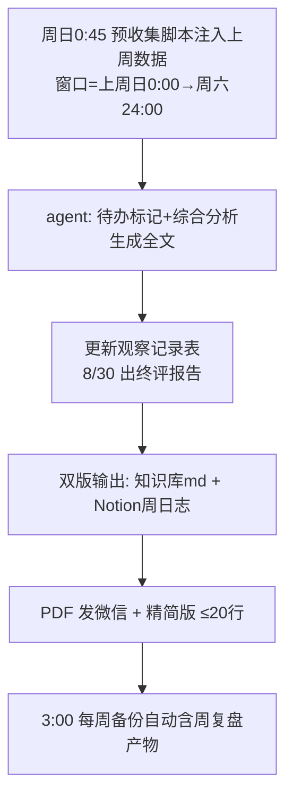
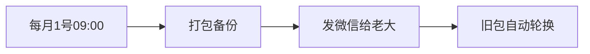
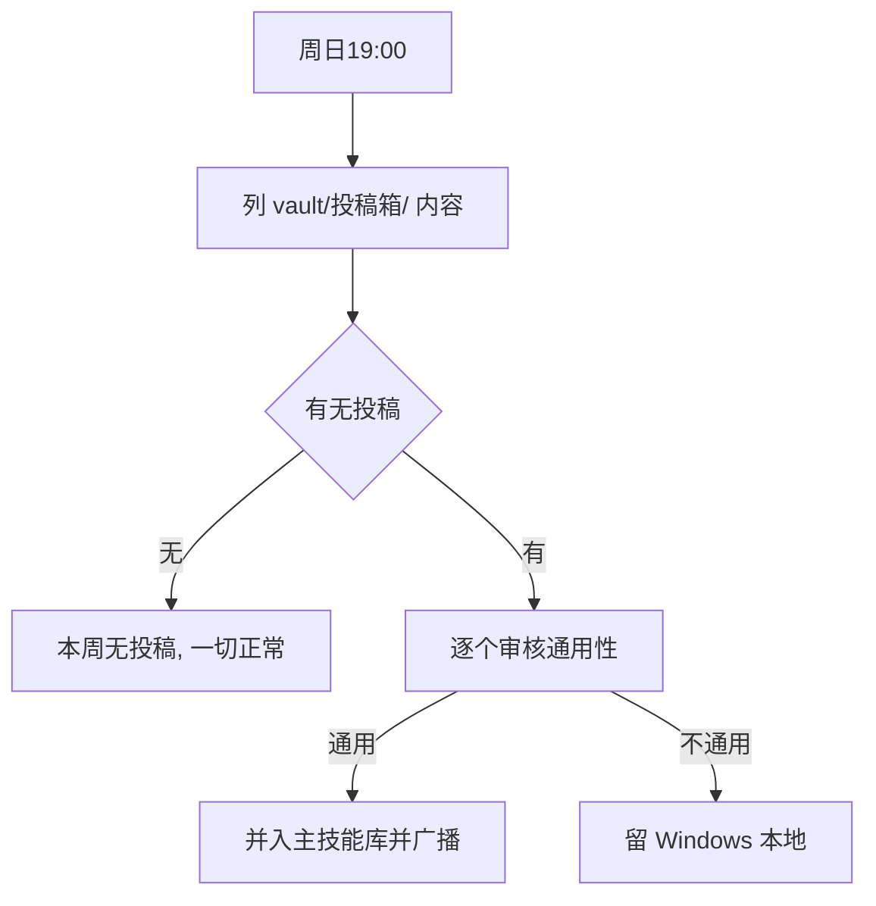

# 📅 每周每月流程

> 周/月周期任务。索引:[[index]] · 每日任务见 [[每日流程]]

## 每周复盘(周日凌晨 0:45,2026-08-15 从 21:00 改凌晨,老大白天醒来即可查看)

> **结构排序逻辑(2026-08-15 定,勿乱改)**:5 组 = 回顾 → 团队 → 运行 → 制度与身体 → 行动。
> 即"先对账过去(总览/上周计划/紧急提示),再看现状(员工/用量/模型/规则/健康),最后定行动(待办/遗留/下周计划/小结)"。
> 高优先级遗留前置为「⚠️ 紧急提示」紧跟回顾组;微信版 ≤20 行,分组标题可省略。

## 每周自动备份(周日 03:00)

## 每月备份发微信(1 号 09:00)

## 投稿审核(周日 19:00)

## 相关
[[每日流程]] · [[index]] · [[定时任务清单]]
