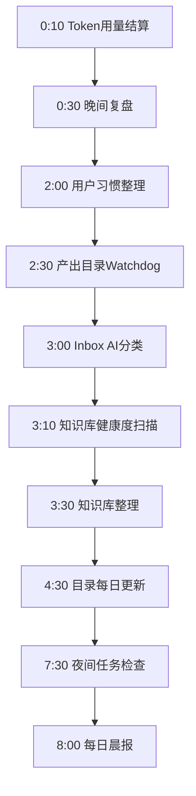
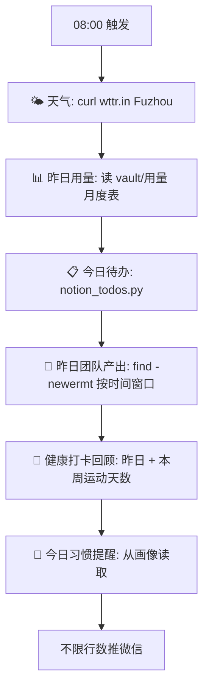
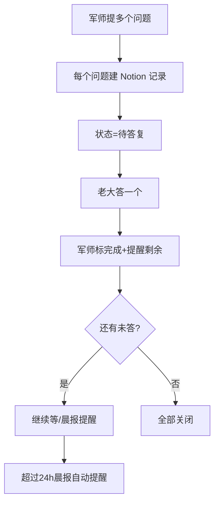

# ⏰ 每日流程

> 每天自动运行的任务。索引:[[index]] · 其他周期见 [[每周每月流程]]

## 夜间任务链（00:10-08:00，享受 TP 非高峰 0.8x 系数）

### 依赖关系（已配置 context_from）
- Token用量结算 → 独立（脚本直出）
- 晚间复盘 → 依赖 Token用量结算（usage 数据注入）
- 习惯整理 → 依赖晚间复盘（复盘结果作为画像更新依据）
- 知识库整理 → 依赖 Inbox AI分类（分类结果注入）
- 夜间任务检查 → 依赖知识库整理（验证整理完成）
- 晨报 → 独立（汇总全天产出）

### 各任务详情

| 时间 | 任务 | 类型 | 产出 |
|---|---|---|---|
| 0:10 | Token 用量结算 | script | vault/用量/月度文件 |
| 0:30 | 用量截图提醒 | script | 无（触发用户截图） |
| 1:00 | 技能与MCP推荐 | agent | 推送微信 |
| 2:00 | 用户习惯整理 | agent | 画像+Memory+SOUL |
| 3:00 | 每周自动备份 | script | backup/（仅周日） |
| 3:30 | 知识库整理 | agent | wiki/ 归档 |
| 4:30 | 目录每日更新 | script | 实体/能力/知识库目录 |
| 7:00 | 夜间任务检查 | script | 推送执行状态 |

## 白天任务

| 时间 | 任务 | 类型 | 说明 |
|---|---|---|---|
| 8:00 | 每日晨报 | agent | 天气/用量/待办/产出/健康/提醒 |
| 每30分钟 | 服务器监控 | script | 脚本零成本 |

## 晨报详情（08:00）

## 相关

[[每周每月流程]] · [[index]] · [[定时任务清单]]

## 待答复追踪

### 规则
- 多个问题必须编号（Q1/Q2/Q3）
- 每个问题建 Notion 待答复记录
- 用户答一个 → 标完成 + 提醒剩余
- 晨报每日展示未答问题
- 超过 24h 未答 → 晨报自动提醒

### 工具
- 添加：`python3 pending_reply.py add "问题" "备注"`
- 查询：`python3 pending_reply.py list`
- 完成：`python3 pending_reply.py done <page_id>`
