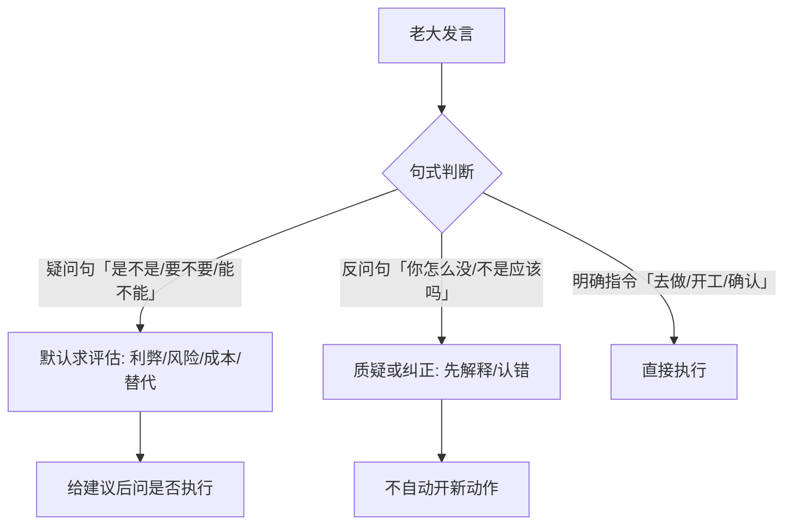
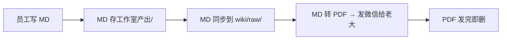

# 💬 沟通交付流程

> 与老大的沟通方式 + 文档交付规则。索引:[[index]]

## 疑问句/反问句先评估(老大 2026-08-13 定)

## 全员产出路径

| 员工 | 产出目录 | 复盘目录 |
|---|---|---|
| 知远（调研员） | `vault/工作室产出/方案架构师·知远/调研报告/<主题>/` | `vault/复盘/员工/方案架构师·知远/` |
| 墨白（写作员） | `vault/工作室产出/写作员·墨白/` | `vault/复盘/员工/写作员·墨白/` |
| 技术员·Claude | `vault/工作室产出/技术员·Claude/` | — |
| 军师（主） | 无专门产出目录（调度+文档整理） | `vault/复盘/军师/` |

## 产出生命周期

### 两个存储的区别

| 位置 | 定位 | 谁用 | 生命周期 |
|---|---|---|---|
| `vault/工作室产出/<岗位>/` | 团队产出记录 | 老大（看 MD）、晨报统计 | 永久保留 MD |
| `vault/wiki/raw/` | 知识资产 | AI 团队（检索/引用） | 永久保留，只读不改 |
| PDF（临时） | 微信交付物 | 老大（手机看） | 发完即删 |

### 发微信的规则

- MD 文件微信打不开，必须转 PDF 再发
- 知识库只存 MD，PDF 不入 vault
- PDF 发完即弃，不保留

## 复盘机制

每单交付后，员工必须写自我复盘：
- **知远**：`vault/复盘/员工/方案架构师·知远/YYYY-MM-DD-<主题>经验总结.md`
- **墨白**：`vault/复盘/员工/写作员·墨白/YYYY-MM-DD-<主题>经验总结.md`
- **军师**：`vault/复盘/军师/YYYY-MM-DD-军师复盘.md`

复盘内容：学到什么/反馈模式/暴露问题/下次 checklist/一句话宣言

⚠️ **派活时军师必须在 prompt 里写明产出路径 + 复盘要求**，否则员工可能不存文件不写复盘。

## 相关

[[index]] · [[用户画像]] · [[知远调研工作流]]
