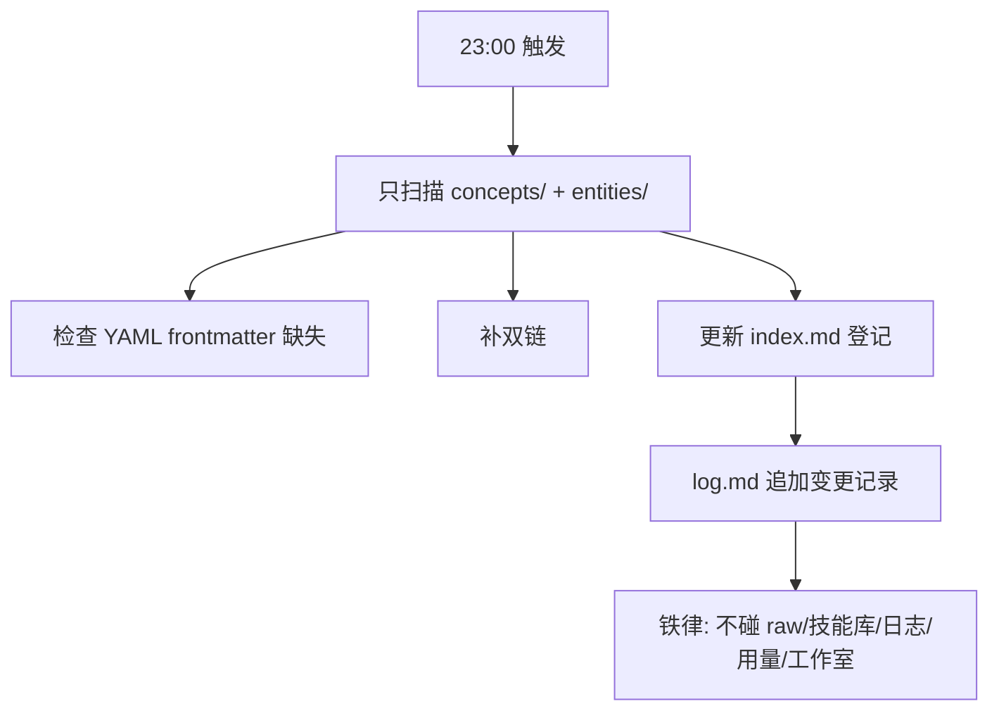
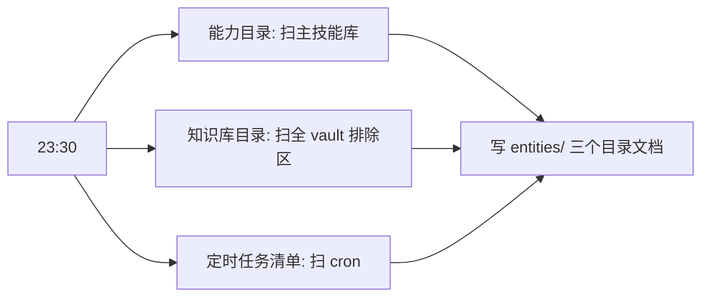
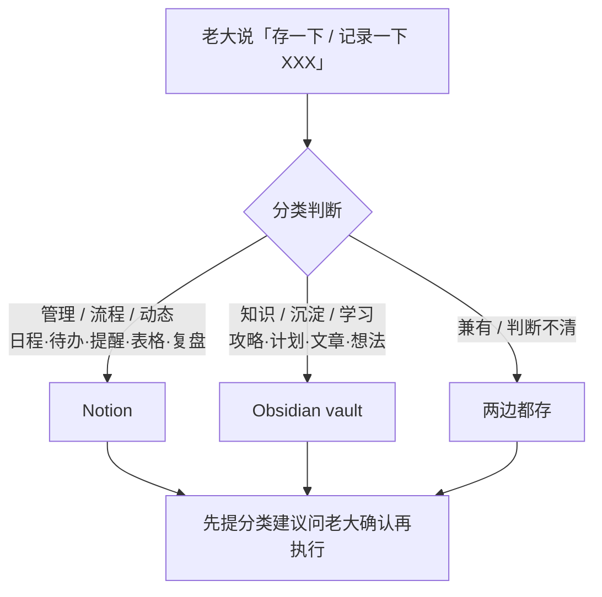

# 📚 知识库流程

> 知识库的整理/登记/归档规则。索引:[[index]]

## 知识库整理(23:00)

```mermaid
flowchart TD
    A[23:00 触发] --> B[只扫描 concepts/ + entities/]
    B --> C[检查 YAML frontmatter 缺失]
    B --> D[补双链]
    B --> E[更新 index.md 登记]
    E --> F[log.md 追加变更记录]
    F --> G[铁律: 不碰 raw/技能库/日志/用量/工作室]
```

## 目录每日更新(23:30, 脚本)

```mermaid
flowchart LR
    A[23:30] --> B[能力目录: 扫主技能库]
    A --> C[知识库目录: 扫全 vault 排除区]
    A --> D[定时任务清单: 扫 cron]
    B --> E[写 entities/ 三个目录文档]
    C --> E
    D --> E
```

## 内容归档规则(老大说「存一下 XXX」)

```mermaid
flowchart TD
    A[老大说「存一下 / 记录一下 XXX」] --> B{分类判断}
    B -->|管理 / 流程 / 动态<br>日程·待办·提醒·表格·复盘| C[Notion]
    B -->|知识 / 沉淀 / 学习<br>攻略·计划·文章·想法| D[Obsidian vault]
    B -->|兼有 / 判断不清| E[两边都存]
    C --> F[先提分类建议问老大确认再执行]
    D --> F
    E --> F
```

## 相关
[[index]] · [[知识库目录]] · [[用户画像]]
