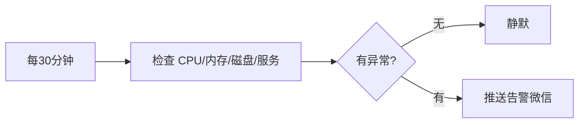
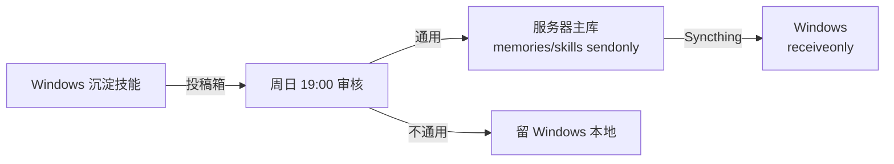

# 🛠️ 运维流程

> 系统监控与多机协作机制。索引:[[index]]

## 服务器监控告警(每 30 分钟)

```mermaid
flowchart LR
    A[每30分钟] --> B[检查 CPU/内存/磁盘/服务]
    B --> C{有异常?}
    C -->|无| D[静默]
    C -->|有| E[推送告警微信]
```

## 决策通道检查(2026-08-15 停用)

## 双 Hermes 技能同步

```mermaid
flowchart LR
    A[服务器主库<br>memories/skills sendonly] -->|Syncthing| B[Windows<br>receiveonly]
    C[Windows 沉淀技能] -->|投稿箱| D[周日 19:00 审核]
    D -->|通用| A
    D -->|不通用| E[留 Windows 本地]
```

## 相关
[[index]] · [[服务器迁移手册]] · [[同步配置]]
